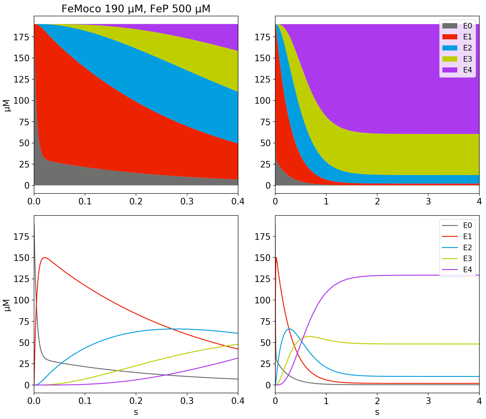
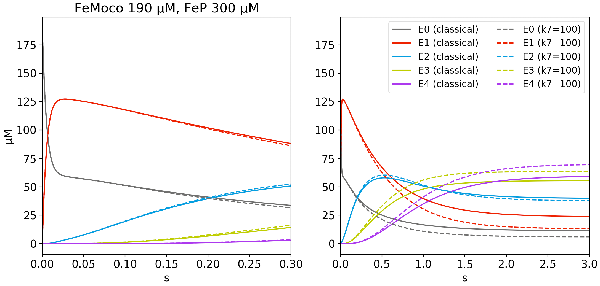

# ltkinetics
Python code for simulating the kinetics of the nitrogenase enzyme system,
following the work of Thorneley and Lowe. 

Each reaction is an instance of the NitrogenaseRxn class. 
The user sets up the starting conditions and SciPy `odeint` (LSODA under the hood) numerically integrates the system forward in time. 
The oridinary differential equations (ODEs) were adapted from the Mathematica code in the doctoral thesis of Phillip E. Wilson (1) 

## Features
The use of the package is demonstrated with two examples. 

In example 1, we integrate a high-flux reaction until the steady state is reached and plot the results both traditionally and stacked:

In example 2, we demonstrate the funciton `set_ks`, which allows the modification of the default LT kinetic constants:

## Requirements
This package was writte in python 3.7 and may not be compatible with previous versions. 
The NitrogenaseRxn class depends on NumPy and SciPy. The examples use Matplotlib for plotting. 

### Disclaimer
This is a work in progress by a non-programmer. All feedback is welcome. 

### References
1. [Wilson's Thesis, advised by Watt](https://scholarsarchive.byu.edu/etd/516/)
