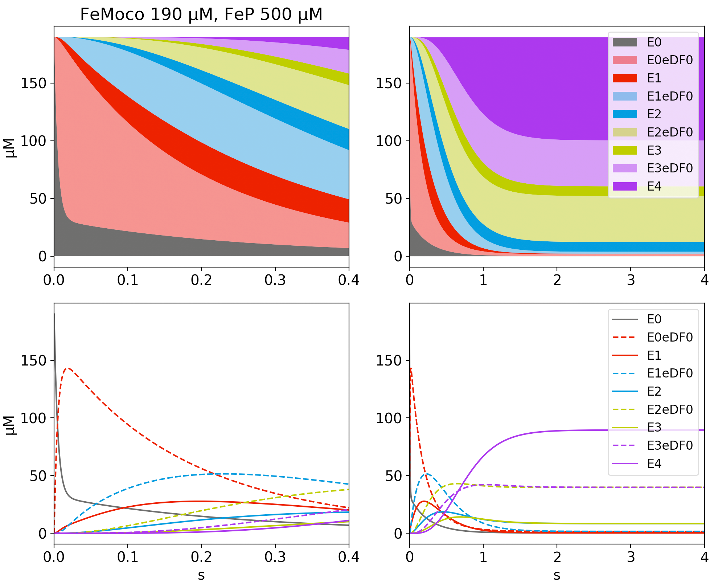

# ltkinetics
A python package for simulating the kinetics of the nitrogenase enzyme system, following the work of Thorneley and Lowe. 

Each reaction is an instance of the NitrogenaseRxn class. 
The user sets up the starting conditions and SciPy `odeint` (LSODA under the hood) numerically integrates the system forward in time. 
The oridinary differential equations (ODEs) were adapted from the Mathematica code in the doctoral thesis of Phillip E. Wilson (1).

## Usage
ltkinetics can be run easily from the terminal using the provided ltscript.py, or imported as a regular python package. The latter option is required to access all features. 

### Via ltscript.py:
1. Open ltscript.py in a text editor and provide starting conditions.
2. Run the script using e.g. `./ltscript.py`. The script must remain in the same directory as the ltkinetics folder. 
3. Open the `-E-pops.dat` file in any plotting program.

### As a python package:
1. Open example1.py in your IDE of choice.
2. Make sure the folder `ltkinetics` in the current working directory (or add it to your `PYTHONPATH`).

## Features
The use of the package is demonstrated with three examples. 

In example 1, we integrate a high-flux reaction until the steady state is reached and plot the results both traditionally and stacked:

In example 2, we demonstrate the funciton `set_ks`, which allows the modification of the default LT kinetic constants:

In example 3, we do the same thing as example 1, but separate the still-bound MoFe(red)•FeP(ox,ADP) states

## Requirements
This package was written in python 3.7 and may not be compatible with previous versions of python. Your python version can be checked with `python3 --version`

The NitrogenaseRxn class depends on NumPy and SciPy. The examples use Matplotlib for plotting. 

If you have not yet set up a python environment with NumPy and SciPy, this is easily accomplished on most platforms using [anaconda](https://docs.anaconda.com/anaconda/install/)

### Disclaimer
This is a work in progress; feedback is welcome. 

### References
1. [Wilson's Thesis, advised by Watt](https://scholarsarchive.byu.edu/etd/516/)
